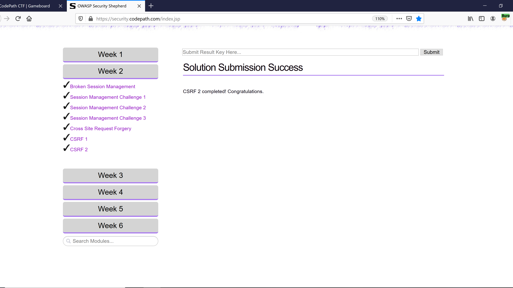
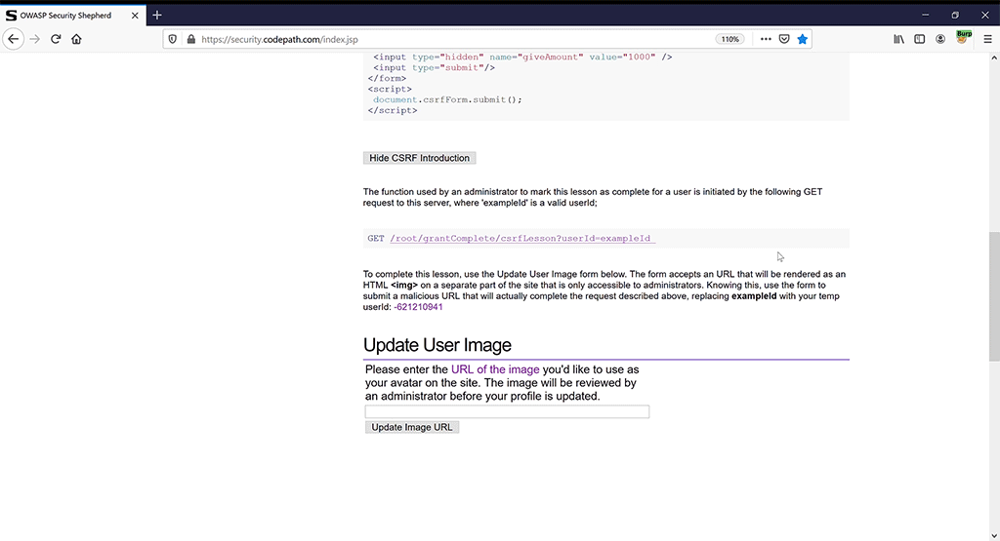

# Week 2 lab

## Week 2

## Broken Session Management

## Session Manegement 1

## Session Management 2

## Session Management 3

## Cross Site Forgery Request

## Cross Site Forgery Request 1

## Cross Site Forgery Request 2

